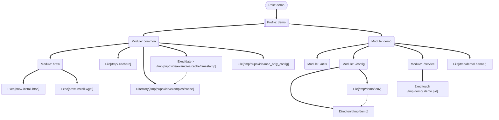

# Pupoxide (Puppet for the Rust Era)

Pupoxide is a high-performance, memory-safe, and declarative configuration management tool inspired by Puppet, built with Rust and the Rhai scripting engine.

> [!WARNING]
> **Experimental Project / Proof of Concept**
>
> This project is an attempt to reimplement the core ideas of Puppet using Rust. It is **not ready for production use** and serves primarily as an architectural experiment and a playground for ideas.
>
> We are actively looking for **contributors**! If you are interested in Rust, configuration management, or language design, please feel free to open issues or submit PRs.

## Key Features

- **Declarative DSL**: Use [Rhai](https://rhai.rs/) scripts for clear, modular manifests.
- **Hexagonal Architecture**: Core logic isolated from system-specific implementation.
- **Parallel Execution**: Automatically evaluates independent resources in parallel for maximum performance.
- **Environment & Module Support**: Organize configuration in environments like `production` or `staging`.
- **Idempotency**: Resources ensure the desired system state without redundant actions.
- **Graph Visualization**: Built-in dependency graph visualization (ASCII and Mermaid).

## Installation

```bash
git clone https://gitverse.ru/itmagelab/pupoxide
cd pupoxide
cargo build --release
```

## Quick Start

### Run Examples Tests

The fastest way to test Pupoxide's complete bootstrap and certificate workflow:

```bash
bash examples/test_bootstrap.sh
```

This runs an automated 8-step test that demonstrates the three-phase bootstrap process. See [examples/README.md](examples/README.md) for detailed manual testing instructions.

### Dry-Run Mode (Preview)

You can preview changes without applying them by using the `--dry-run` flag with `run`, `apply`, or `agent` commands:

```bash
cargo run -- --config ./examples run --dry-run --file ./examples/environments/production/manifests/site.rhai
```

This will log actions as "Would ensure resource" instead of executing them.

### Graph Visualization

You can visualize the resource dependency graph for debugging or documentation. Support for ASCII tree (terminal) and Mermaid (documentation) is built-in.

```bash
# Default ASCII tree
cargo run -- --config ./examples graph --file ./examples/environments/production/manifests/site.rhai

# Mermaid syntax for documentation
cargo run -- --config ./examples graph --file ./examples/environments/production/manifests/site.rhai --style mermaid
```

#### ASCII Example
```text
Dependency Graph:
└─ Role: demo
  └─ Profile: demo
    └─ Module: common
      └─ Module: brew
        ├─ Exec[brew-install-htop]
        ├─ Exec[brew-install-wget]
      ├─ File[/tmp/.cacherc]
      ├─ Directory[/tmp/pupoxide/examples/cache]
      ├─ Exec[date > /tmp/pupoxide/examples/cache/timestamp]
      │  └─→ Directory[/tmp/pupoxide/examples/cache]
      ├─ File[/tmp/pupoxide/mac_only_config]
    └─ Module: demo
      └─ Module: ./utils
      └─ Module: ./config
        ├─ Directory[/tmp/demo]
        ├─ File[/tmp/demo/.env]
        │  └─→ Directory[/tmp/demo]
      └─ Module: ./service
        ├─ Exec[touch /tmp/demo/.demo.pid]
      ├─ File[/tmp/demo/.banner]
```

#### Mermaid Example


### 1. Run a single manifest

You can execute any `.rhai` script directly:

```bash
cargo run -- --config ./examples run --file ./examples/environments/production/manifests/site.rhai
```


### 2. Apply an environment

Apply all manifests from a specific environment using the Puppet-like directory structure:

```bash
# Default config path is /etc/pupoxide
cargo run -- --config ./examples apply --environment production
```

#### Parallel Execution Example
Pupoxide automatically detects independent parts of your configuration and applies them concurrently:

```text
Configuring Pupoxide Example on port 7070
Default package manager: brew (from 15.6.1 level)

Catalog Application Summary:
------------------------------------------------------------
[demo::demo::demo::config] Directory[/tmp/demo] ................ [UNCHANGED] (0ms)
[demo::demo::common] Directory[/tmp/pupoxide/examples/cache] ... [UNCHANGED] (0ms)
[demo::demo::demo] File[/tmp/.cacherc] ......................... [UNCHANGED] (1ms)
[demo::demo::common] File[/tmp/app_config.txt] ................. [UNCHANGED] (2ms)
[demo::demo::common] Exec[brew-install-htop] ................... [UNCHANGED] (380ms)
[demo::demo::common] Exec[brew-install-wget] ................... [UNCHANGED] (380ms)
[demo::demo::common] Exec[/bin/sleep 2] ........................ [SUCCESS] (2.01s)
------------------------------------------------------------
Summary: 1 applied, 11 unchanged, 0 failed (Total: 2.02s)
```
*(Note: brew commands and sleep are independent and were evaluated in parallel)*

### 3. Client-Server Mode

Pupoxide can operate in a Master/Agent architecture with secure mutual TLS (mTLS) authentication.

#### Three-Phase Bootstrap Process

Pupoxide implements a secure three-phase bootstrap process:

**Phase 1: Request** (Agent submits CSR)
- Agent generates a private key and Certificate Signing Request (CSR)
- Agent sends CSR to Master (no token needed)
- Master stores the request as "pending" in `/etc/pupoxide/bootstrap_requests/`
- Agent saves the private key locally

**Phase 2: Approval** (Admin reviews and approves)
- Admin views pending requests on Master
- Admin approves/rejects requests using Master command
- Master updates request status to "approved" or "rejected"
- Request stored with status in filesystem

**Phase 3: Activation** (Agent retrieves signed certificate)
- Agent polls Master to check if request was approved
- Upon approval, Master signs the certificate and stores agent metadata
- Agent downloads and saves signed certificate
- Agent can now connect using mTLS

#### Usage

**Start the Master Server:**

```bash
cargo run -- --config ./examples master start --port 8080
```

The Master will automatically:
- Generate a CA certificate in the config directory
- Create `/bootstrap_requests/` for pending CSRs
- Create `/agents/` for registered agent certificates

**Step 1: Submit Bootstrap Request** (on Agent machine):

```bash
# Agent submits CSR request (no token needed)
cargo run -- --config ./examples agent \
  --server http://localhost:8080 \
  --node agent-01 \
  --environment production \
  --cert-dir ./examples/certs/agents/agent-01 \
  --bootstrap
```

Output:
```
✓ Bootstrap request submitted!
  Node ID: agent-01
  Status: pending
  Message: Request received. Awaiting admin approval.

→ Admin must approve request before agent can run.
```

**Step 2: Admin Reviews and Approves** (on Master machine):

```bash
# List all pending requests
cargo run -- --config ./examples master list

# Approve a request
cargo run -- --config ./examples master sign --node agent-01

# Or reject it
cargo run -- --config ./examples master reject --node agent-01
```

Output:
```
✓ Node 'agent-01' has been approved and registered
```

**Step 3: Agent Checks Status and Gets Certificate** (on Agent machine):

```bash
# Poll until approved (checks every 5 seconds, default timeout 10 minutes)
cargo run -- --config ./examples agent \
  --server http://localhost:8080 \
  --node agent-01 \
  --environment production \
  --cert-dir ./examples/certs/agents/agent-01 \
  --check

# Or with custom timeout
cargo run -- --config ./examples agent \
  --server http://localhost:8080 \
  --node agent-01 \
  --environment production \
  --cert-dir ./examples/certs/agents/agent-01 \
  --check --check-timeout 300
```

Output when approved:
```
✓ Bootstrap approved!
  Certificate saved to: "/etc/pupoxide/agents/agent-01/agent.pem"

→ You can now run the agent:
  pupoxide agent --server http://localhost:8080 --node agent-01 --environment production
```

**Step 4: Run the Agent** (Phase 3 - regular operation with mTLS):

Once bootstrap is complete and approved, run the agent normally:

```bash
# Agent connects using mTLS with signed certificate
cargo run -- --config ./examples agent \
  --server https://localhost:8080 \
  --node agent-01 \
  --environment production \
  --cert-dir ./examples/certs/agents/agent-01
```

The agent will:
1. Load the signed certificate and private key
2. Connect to Master via mTLS
3. Request the catalog for the node
4. Apply the configuration

#### File Structure

```
/etc/pupoxide/
├── environments/
│   └── production/
│       ├── manifests/
│       ├── modules/
│       ├── role/
│       └── profile/
├── certs/                           # Certificate management (CA and agents)
│   ├── ca.pem                       # CA public certificate
│   ├── ca.key                       # CA private key
│   ├── bootstrap_requests/
│   │   ├── agent-01.json           # Pending CSR (status: pending)
│   │   ├── agent-02.json           # Approved CSR (status: approved)
│   │   └── agent-03.json           # Rejected CSR (status: rejected)
│   └── agents/
│       ├── agent-01.pem            # Signed certificate
│       ├── agent-01.json           # Metadata (registration time, etc)
│       ├── agent-02.pem
│       └── agent-02.json
```

#### Security Features

✅ **No Pre-shared Secrets**: No bootstrap tokens needed  
✅ **Manual Approval**: Admin must explicitly approve each agent  
✅ **Mutual TLS (mTLS)**: Both agent and master verify each other  
✅ **Dynamic Certificates**: Each agent gets a unique signed certificate  
✅ **Private Key Protection**: Private keys never leave the agent (0600 permissions)  
✅ **Encrypted Communication**: All post-bootstrap communication is encrypted  
✅ **Audit Trail**: All requests stored in filesystem for review  
✅ **Reject Capability**: Admin can reject malicious requests  
✅ **Exclusive Lock**: Only one agent instance can run at a time (prevents concurrent execution)
// Assign role to the current node
"demo".role;
```

## Directory Structure

Pupoxide follows a modular structure for easier management:

```text
[config_dir]/
  environments/
    production/
      manifests/
        site.rhai      # Entry point for the environment (imports roles)
      modules/
        systemd/       # Systemd module (manages units)
        brew/          # Homebrew module (manages packages)
        common/        # Common settings
        demo/          # Demo module
      role/            # Roles: Business logic abstraction
        demo.rhai      # Example Role
      profile/         # Profiles: Technology stack wrapper
        demo.rhai      # Example Profile

## Roles and Profiles Pattern
Pupoxide encourages the standard "Roles and Profiles" pattern to organize your code logic:

- **Roles**: High-level business abstractions (e.g., "Webserver", "Database Node").
  - **Constraints**: Roles can ONLY include Profiles. They cannot contain resources (`file`, `exec`) or include modules directly.
- **Profiles**: Technical stacks that wrap modules (e.g., "Nginx with PHP", "Postgres Hardened").
```

```rust
// role/demo.rhai
"demo".profile;
```

```rust
// profile/demo.rhai
"common".include;
"demo".include;
```

```rust
// modules/common/manifests/init.rhai
import "brew" as b;

// Install packages using the 'brew' module
b::pkg(["htop", "wget"], #{ ensure: "present" });

// Define a file
file("/tmp/.cacherc", #{
    ensure: "present",
    content: "Global settings"
});

// Conditional logic based on facts
if facts["os_family"] == "Darwin" {
    file("/tmp/pupoxide/mac_only_config", #{
        ensure: "present",
        content: "This is macOS"
    });
}
```

```

## Documentation
- [Project Vision](doc/vision.md)
- [Coding Conventions](doc/conventions.md)
- [Development Workflow](doc/workflow.md)
- [Task List](doc/tasklist.md)
