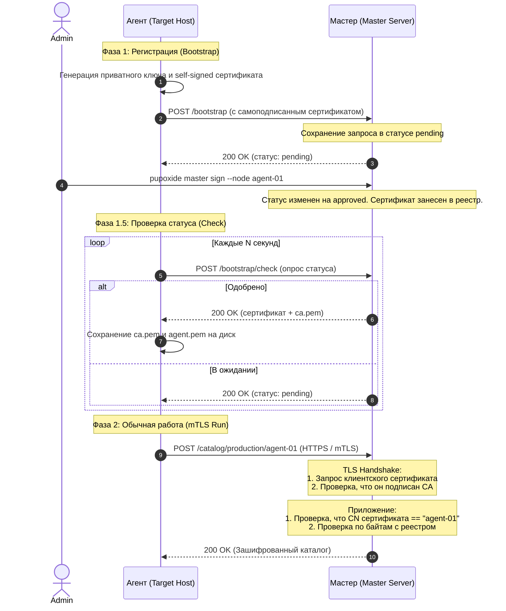

# Документация: Безопасность и Взаимный TLS (mTLS)

В Pupoxide сетевое взаимодействие между Агентом и Мастером защищено с помощью протокола **Mutual TLS (mTLS)**. Это обеспечивает:
1. **Конфиденциальность**: Шифрование всего сетевого трафика.
2. **Аутентификацию сервера**: Агент доверяет только тому Мастеру, который владеет доверенным CA.
3. **Аутентификацию агента**: Мастер проверяет цифровую подпись агента и сверяет его сертификат с реестром одобренных узлов.
4. **Защиту от спуфинга (Node Spoofing)**: Узел не может получить доступ к каталогу конфигурации другого узла.

---

## Схема взаимодействия

Ниже представлена диаграмма процесса регистрации (Bootstrap) и последующих запросов каталога (mTLS Run):



---

## Детальное описание фаз жизненного цикла

### 1. Фаза регистрации (Bootstrap)

В момент первого запуска агент еще не имеет доверенного сертификата от Мастера и не знает корневого CA. Процесс устроен следующим образом:

1. **Генерация ключей локально**: Агент использует библиотеку `rcgen` для генерации приватного ключа (`agent.key`) и временного самоподписанного сертификата (`agent-self-signed.pem`). Публичный ключ агента помещается в CSR (Certificate Signing Request).
2. **Отправка запроса**: Агент отправляет POST-запрос на `/bootstrap` Мастера по протоколу HTTPS. Так как файла `ca.pem` у агента еще нет, HTTP-клиент временно настраивается на обход проверки TLS-сертификата (`danger_accept_invalid_certs(true)`). Вместе с запросом передается самоподписанный сертификат.
3. **Ожидание одобрения**: Запрос сохраняется на диске (или в БД) Мастера в статусе `pending`. Сервер возвращает ответ, что запрос ожидает ручного подтверждения администратором.
4. **Команда одобрения**: Администратор выполняет команду:
   ```bash
   pupoxide master sign --node <имя_ноды>
   ```
   После этого статус запроса переводится в `approved`, а самоподписанный сертификат агента копируется в постоянный реестр доверенных агентов (`certs/agents/<node_name>.pem`).

5. **Опрос статуса**: Агент периодически опрашивает эндпоинт `/bootstrap/check`. Как только запрос становится одобренным, Мастер возвращает в JSON-ответе:
   * `ca_certificate`: корневой сертификат CA Мастера (`ca.pem`).
   * `certificate`: одобренный сертификат агента.
6. **Сохранение**: Агент сохраняет сертификат `agent.pem` и корневой `ca.pem` локально на диск.

---

### 2. Взаимная проверка (mTLS) при обычной работе

После успешной регистрации агент выполняет регулярные проверки конфигурации, используя строгое взаимное TLS-соединение.

#### На стороне Агента:
Агент настраивает `reqwest::Client` на безопасную работу:
* Загружает `ca.pem` и добавляет его в доверенное хранилище клиента (`add_root_certificate`). Теперь агент доверяет только тому серверу, чей сертификат подписан этим CA.
* Загружает `agent.key` и `agent.pem` в качестве клиентской идентичности (`Identity`).

#### На стороне Мастера:
Мастер использует `tokio-rustls` для управления входящими TLS-соединениями.
* Инициализируется `rustls::ServerConfig`.
* Используется кастомный `OptionalClientCertVerifier`. Он предлагает клиенту предоставить сертификат (`offer_client_auth = true`), но не разрывает соединение при его отсутствии (`client_auth_mandatory = false`). Это позволяет нерегистрированным агентам достучаться до `/bootstrap` по HTTPS.
* При успешном прохождении TLS-рукопожатия сервер извлекает байты клиентского сертификата, парсит его Common Name (CN) с помощью функции `extract_cn_from_der` и сохраняет идентичность (`ClientIdentity { cn, cert_der }`) в расширение запроса (`axum::http::Request::extensions_mut`).

---

## Авторизация и защита от спуфинга (Node Spoofing)

При получении запроса каталога на `/catalog/{env}/{node}` Мастер выполняет тройную проверку безопасности:

1. **Наличие сертификата**: Если в запросе отсутствует `ClientIdentity` (клиент не прошел аутентификацию по сертификату), сервер возвращает ошибку `401 Unauthorized`.
2. **Проверка соответствия имени (CN == Node ID)**: Сервер сравнивает `Common Name` (CN) из TLS-сертификата с параметром `{node}` в пути URL. Это гарантирует, что хост `agent-02` не сможет запросить каталог для `agent-01`, даже если оба агента легитимны. В случае несовпадения возвращается `403 Forbidden`.
3. **Побайтовая проверка сертификата**: Сервер извлекает из реестра (`agent_registry`) сохраненный при бутстрапе сертификат для данного `{node}` и сравнивает его DER-байты с байтами сертификата, предоставленного клиентом в текущем TLS-соединении. Это защищает от использования сторонних сертификатов, подписанных тем же CA, но не внесенных в реестр. В случае несовпадения возвращается `403 Forbidden`.

---

## Структура файлов на диске

### Агент:
* `/etc/pupoxide/agents/<node_name>/agent.key` — Приватный ключ агента.
* `/etc/pupoxide/agents/<node_name>/agent-self-signed.pem` — Временный самоподписанный сертификат.
* `/etc/pupoxide/agents/<node_name>/agent.pem` — Одобренный сертификат (копия оригинального).
* `/etc/pupoxide/agents/<node_name>/ca.pem` — Корневой сертификат CA Мастера (используется для проверки подлинности сервера).

### Мастер:
* `<config_dir>/certs/ca.pem` — Корневой сертификат CA.
* `<config_dir>/certs/ca.key` — Приватный ключ CA (используется для подписи).
* `<config_dir>/certs/server.pem` — Сертификат сервера Master (подписан CA).
* `<config_dir>/certs/server.key` — Приватный ключ сервера Master.
* `<config_dir>/certs/bootstrap_requests/<node_name>.json` — Метаданные запроса регистрации.
* `<config_dir>/certs/agents/<node_name>.pem` — Одобренный и сохраненный сертификат агента.
* `<config_dir>/certs/agents/<node_name>.json` — Регистрационные метаданные агента.
